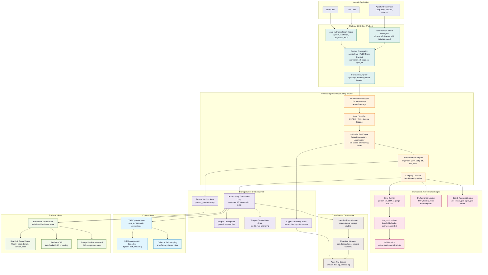

# Foundation Reference for a PRD: Enterprise-Scale Logging & Observability SDK for Agentic AI (Python)

## TL;DR
- **Adopt a hybrid architecture**: capture a rich internal schema optimized for agentic workflows, but make OpenTelemetry GenAI semantic conventions (`gen_ai.*`) the canonical wire format for export — this avoids vendor lock-in even though the OTel GenAI conventions remain in "Development" (experimental) status and were only moved to a dedicated repo (`open-telemetry/semantic-conventions-genai`) with the **v1.42.0 release on 12 June 2026**, which was explicitly "not a graduation to stable."
- For log storage, a **Delta Lake-inspired append-only transaction log** (ordered JSON commits + periodic Parquet checkpoints + optimistic concurrency) is the right inspiration, but reconcile immutability with GDPR Article 17 erasure via **crypto-shredding** (per-subject keys) rather than physical deletion.
- The most under-specified risks are **graceful degradation (fail-open by default for the host app), PII redaction at source, per-tenant cost attribution, and tamper-evident audit trails** — these must be first-class PRD requirements, not afterthoughts. Cost discipline matters because agentic systems consume roughly 4x the tokens of standard chat (≈15x for multi-agent systems, per Anthropic data cited by Oracle Developers), and unbounded loops are real: a documented November 2025 LangChain incident ran four agents for 11 days returning HTTP 200 on every call until a ~$47,000 cloud invoice arrived.
- **Prompts must be treated as versioned, evaluable artifacts** — automatically fingerprinted, human-titleable, and gated behind standard success/performance evaluations before promotion — since no reviewed off-the-shelf tool (Langfuse, LangSmith) currently combines automatic version detection with automated eval-on-change.

## Key Findings
1. OTel GenAI conventions are the emerging standard but **not stable** — build on them behind an internal schema abstraction and use the stability opt-in flag.
2. **Langfuse** (MIT, self-hostable) is the closest open-source reference architecture; its masking callback, ClickHouse-based ingestion pipeline, and prompt management (versioning + labels/rollout aliases) are directly instructive — though it lacks branching and automated eval-on-change.
3. **Delta Lake's `_delta_log`** design is the best storage inspiration; Iceberg's manifest model and Hudi's merge-on-read are viable alternatives depending on read/write patterns.
4. **Microsoft Presidio's** decoupled analyzer/anonymizer architecture is the state-of-practice for PII; redact at source (client-side) with a server-side fail-closed callback as a safety net.
5. Distributed tracing must use **W3C Trace Context** (`traceparent`/`tracestate`) for cross-process propagation, with **structlog's** `contextvars`-based context binding for in-process async safety.
6. **Prompt-version awareness closes a real gap** in the observability market: content-hash-based auto-detection + human titles + regression-gated promotion is not offered end-to-end by any single reviewed tool (Confident AI is closest, but is proprietary and not agentic-log-native).

## Details

### 1. Prior Art Evaluation

**OpenTelemetry GenAI semantic conventions.** OTel formed the GenAI Special Interest Group in April 2024 under the Semantic Conventions SIG. As of the v1.42.0 release on 12 June 2026, all `gen_ai.*` attributes and spans were moved out of the main `open-telemetry/semantic-conventions` repo into the dedicated `open-telemetry/semantic-conventions-genai` repository; this was a structural move, explicitly "not a graduation to stable." Every GenAI span, metric, event, and attribute remains **Development** status. The data model spans traces, metrics, logs, and events. Verbatim-confirmed names:

- **LLM call spans**: `gen_ai.provider.name` (Required discriminator; replaced `gen_ai.system` in v1.37, Aug 2025; values include `openai`, `anthropic`, `aws.bedrock`, `gcp.gemini`), `gen_ai.request.model`, `gen_ai.response.model`, `gen_ai.usage.input_tokens`, `gen_ai.usage.output_tokens`, `gen_ai.usage.reasoning_tokens`, `gen_ai.usage.cache_read.input_tokens`, `gen_ai.usage.cache_creation.input_tokens` (cache attrs added ~v1.40), `gen_ai.response.finish_reasons`, `gen_ai.request.temperature`, `gen_ai.request.max_tokens`.
- **Agent spans**: `gen_ai.agent.id`, `gen_ai.agent.name`, `gen_ai.agent.description`, `gen_ai.conversation.id`. Operation names (`gen_ai.operation.name` enum): `create_agent`, `invoke_agent`, `invoke_workflow`, `plan` (v1.41 split `invoke_agent` into CLIENT/INTERNAL kinds).
- **Tool spans**: `gen_ai.tool.name`, `gen_ai.tool.call.id`, `gen_ai.tool.type` (`function` = client-executed, `extension` = agent-side API call), `gen_ai.tool.description`, operation `execute_tool` (v1.41 requires tool name in span name).
- **Metrics**: `gen_ai.client.token.usage` (Histogram, unit `{token}`, split by `gen_ai.token.type` input/output), `gen_ai.client.operation.duration` (Histogram, unit `s`), `gen_ai.server.time_to_first_token` (Histogram, unit `s`), `gen_ai.server.time_per_output_token` (Histogram). **In-flight change**: pending PR #197 may replace the `gen_ai.client.token.usage` histogram with counters plus opt-in per-operation histograms — do not treat token metrics as frozen.
- **Version transitions**: `OTEL_SEMCONV_STABILITY_OPT_IN=gen_ai_latest_experimental` forces emission of the current schema; default keeps legacy (≤v1.36) behavior.
- **MCP tool calls** (v1.39): spans carry `mcp.method.name`, `mcp.session.id`, `mcp.protocol.version`; instrumentation enriches existing spans rather than duplicating.
- **Pros**: vendor-neutral, CNCF-backed, adopted by Datadog, Google Cloud, AWS, Azure, MLflow; huge ecosystem (Collector, Jaeger, Tempo, Grafana, OTLP exporters). **Cons**: still in flux (attribute names change per release); per-message chat history was revamped in v1.37 due to event flooding; multi-step agent reasoning "can't be captured in a fixed schema."

**Langfuse** — Open-source (MIT), self-hostable LLM engineering platform; same codebase for Cloud, OSS, Enterprise. Ingestion pipeline: events written to blob storage bucket → Worker calls masking callback → processed into ClickHouse. Data masking via `mask` parameter (client-side) and `mask_otel_spans` (export-stage, since June 2026) plus a server-side masking callback. `LANGFUSE_INGESTION_MASKING_CALLBACK_FAIL_CLOSED` and `LANGFUSE_INGESTION_MASKING_CALLBACK_TIMEOUT_MS` control behavior (default 500ms timeout balances reliability with performance); note events are written to the event blob storage bucket before the Worker calls the masking callback. Cloud is SOC 2 Type II and ISO 27001 certified, GDPR compliant, HIPAA aligned; stores data as-is by default; per-project retention configurable. **Prompt Management**: centrally manage, version-control, and collaboratively iterate on prompts with strong server/client-side caching so iteration doesn't add latency; supports labels/rollout aliases (e.g., `production`), automatically links prompt changes to production traces, but uses **linear versioning only** (no branching — parallel experimentation needs separate prompt entries) and has **no built-in automated evaluation workflow**. Often paired with an LLM gateway (LiteLLM) for PII redaction.

**LangSmith** — LangChain's platform; Prompt Hub offers versioning and a playground but no branching/approval workflows; best-in-class tracing for LangChain/LangGraph teams, but highest vendor lock-in risk of the major tools and observability depth drops outside the LangChain ecosystem.

**Helicone** — Open-source proxy-based (one-line integration, point SDK at proxy); built-in caching, cost tracking against 300+ models, smart routing. Proxy model = minimal friction but shallow tracing depth.

**AgentOps** — Agent-specific; supports 400+ LLMs and major frameworks with time-travel debugging.

**W&B Weave** — For ML teams already on Weights & Biases; auto-logging, experiment comparison.

**Arize Phoenix / Arize AX** — Phoenix is OSS, OTel-native, strong eval metrics (RAGAS support); AX is proprietary SaaS with PCI-DSS/financial compliance focus.

**Datadog LLM Observability** — Natively supports OTel GenAI SemConv (v1.37 schema); forwards GenAI spans into Agent Observability without duplicate instrumentation.

**Traceloop / OpenLLMetry** — OSS, OpenTelemetry-native (traceloop/openllmetry shows ~7.1k stars / 947 forks as of the v0.60.0 release, 19 Apr 2026); leads the OTel LLM semconv WG. SDK adds `@workflow`/`@task` decorators; pipes into Datadog, Honeycomb, Grafana, New Relic.

**Portkey** — AI gateway with observability as a feature; routing, failover, guardrails, budgets, prompt management. Tracing depth between Helicone (shallow) and Langfuse (deep).

**Humanloop / PromptLayer / Maxim AI / Confident AI (prompt-management-focused tools).** Humanloop is prompt-management-primary (proprietary, $99/mo+): polished prompt editor, model config, parameter tuning, evaluation for comparing prompt versions, but no git-style branching or approval workflows. PromptLayer offers a strong prompt registry and visual editor with a no-code interface for non-technical stakeholders, but is not a full eval-first platform with a production-to-test loop. Maxim AI uniquely connects prompt versioning directly to simulation, evaluation, and observability in a single closed-loop system, with pre-built and custom evaluators configurable at session/trace/span level. Confident AI is the only reviewed platform with **git-based prompt management** — branching, commit history, approval workflows, and eval actions that run on every commit or merge — plus observability that scores live production traffic with 50+ metrics and tracks quality per prompt version over time with drift alerts. **Gap**: none of these are purpose-built for agentic-log-native, self-hosted, multi-regime-compliant deployments — the automated detection + titling + eval-gating pattern (Section 8) should be built in-house, informed by Langfuse's caching/alias model and Confident AI's eval-on-commit model.

**Delta Lake storage format.** The `_delta_log` directory is an ordered, immutable, append-only transaction log: each commit is a monotonically increasing JSON file (`00000...0.json`), and every ~10 commits a Parquet checkpoint compacts state for fast reads. ACID via **optimistic concurrency control**: writers assume conflicts are rare, write data files first (invisible until commit), then attempt to write the next versioned JSON; if that version already exists, retry with the next number (mutual exclusion / MVCC). Relies on atomic file operations of cloud object stores. Time travel via version/timestamp (default 30-day retention). Schema evolution with protocol versioning. Delta 4.0 added a Delta Kernel for non-Spark engines; Liquid Clustering GA since 3.2.
- **vs Apache Iceberg**: three-layer metadata tree with manifest files storing column-level stats; O(1) snapshots; broadest multi-engine support; leads for analytical reads/predicate pushdown; decouples catalog from storage.
- **vs Apache Hudi**: timeline-based; merge-on-read writes only changed columns to Avro delta logs; best for high-frequency upserts/streaming; born at Uber for record-level upserts.
- **For a logging use case** (append-heavy, occasional deletes for erasure): Delta's simple append-only log is the best conceptual fit; Iceberg's manifest stats help if analytics queries dominate; Apache XTable (co-launched by Microsoft, Google, Onehouse; donated to ASF) provides interoperability across all three.

**Structured logging libraries.**
- **structlog** — processor-pipeline model (every log is a dict passing through composable processors, which can raise `DropEvent` to suppress); fastest of the three; `contextvars`-based context works across asyncio and threads; ideal for redaction/enrichment/sampling processors and large codebases; async via `await logger.ainfo(...)` (best batched). **Recommended for this SDK.**
- **Loguru** — zero-config, built-in rotation/retention, `@logger.catch`, `serialize=True` for JSON, `patch()` to scrub fields. Best for quick setup / smaller apps.
- **Python stdlib logging** — universal but boilerplate-heavy; per-request context needs custom Filter + `contextvars`.
- **OpenTelemetry Python SDK** — vendor-neutral API/SDK split; auto-instruments FastAPI, SQLAlchemy, httpx, Redis; exports to any OTLP backend (Jaeger, Tempo, Prometheus, Datadog, Grafana).

### 2. OTel vs Custom Format Decision Framework

**Recommendation: hybrid.** Maintain a rich internal schema (agentic-native: loop iterations, sub-agent delegation trees, tool-call arguments, retrieved context, eval scores) and provide an OTel-compatible export/interop layer emitting `gen_ai.*` spans/metrics. This mirrors MLflow (`MLFLOW_ENABLE_OTEL_GENAI_SEMCONV` translates internal `mlflow.*` to `gen_ai.*` at export) and Langfuse (ingests OTel from OpenLLMetry/OpenLIT).

- **Adopt OTel wire format for**: interoperability, ecosystem tooling (Collector processors for redaction/sampling/routing, Jaeger/Tempo/Grafana backends), avoiding lock-in, W3C context propagation.
- **Custom rich schema for**: agentic semantics OTel doesn't yet cover well (multi-step reasoning is acknowledged as not fitting a fixed schema), richer typed storage, evaluation/quality data, cost-attribution dimensions, prompt-version metadata (Section 8).
- **Risk of pure OTel**: conventions are Development-status and changing; agent/tool spans only stabilized *conceptually* across v1.38–v1.41.
- **Risk of pure custom**: reinventing collectors/exporters/backends; no ecosystem; lock-in for your own users.

### 3. PII / Sensitive Data Handling

**Detection/redaction.** Microsoft Presidio is the state-of-practice open-source engine: a **decoupled Analyzer (detection) + Anonymizer (redaction)** architecture. The Analyzer combines regex recognizers + a spaCy NER backend + context-aware confidence boosting and supports custom recognizers; the Anonymizer operations are replace, redact, mask, hash, and encrypt (reversible via decrypt). Deployable as Python, PySpark UDF, Docker, or Kubernetes; can delegate to Azure AI Language or AWS Comprehend. Because detection is separate from redaction, you can log "found credit card, 90% confidence" without logging the value. Presidio explicitly does not guarantee finding all PII — layer additional controls.
- **Approaches ranked**: (1) structured field-name/path redaction (cheapest, most precise); (2) regex pattern scrubbing (emails, phones, card-like digit runs); (3) ML-based NER (Presidio/Comprehend) for free text. Managed cloud APIs (AWS Comprehend, Google DLP) incur the exact transmission exposure they mitigate — prefer local detection for sensitive logs.

**Data classification.** Tag fields by class — PII, PCI/financial, PHI, secrets/credentials — with differentiated handling (secrets always dropped; PHI encrypted + residency-controlled; PCI tokenized). Field-level encryption, tokenization, and masking should be selectable per class.

**Multi-regulatory support.** Architect for simultaneous overlapping regimes:
- **GDPR (EU)**: right to erasure (Art. 17, ~30 days), data residency, consent.
- **HIPAA (US health)**: PHI controls, BAA, audit trails.
- **PCI-DSS**: payment data isolation, tokenization.
- **CCPA (California)**: deletion/opt-out.
- **India DPDP Act 2023**: does NOT itself mandate broad localization (Section 16 allows transfer to notified countries), but sector regulators do: **RBI** requires payment system data stored only in India per circular DPSS.CO.OD.No.2785/06.08.005/2017-2018 dated 6 April 2018 ("Storage of Payment System Data"), which mandated "the entire data relating to payment systems... are stored in a system only in India" with a six-month compliance deadline (reporting by 15 October 2018); SEBI requires securities data in India; IRDAI insurance data. Financial institutions comply with BOTH DPDPA and the RBI Master Direction on IT Governance. A hybrid model (India-region deployment for regulated data, e.g., AWS ap-south-1 Mumbai) is common. **Breach-notification conflict to resolve in the PRD**: general DPDPA/RBI summaries cite RBI notification within **72 hours** of breach discovery, but the RBI Cyber Security Framework is separately reported to require a **2-hour** initial notification to RBI's cybersecurity cell — confirm the applicable timeline with legal/compliance before setting alert SLAs, and design for the stricter (2-hour) figure to be safe.
- **SOC 2**: audit trails, access controls.
- **Cross-cutting mechanisms**: data-residency/storage-location controls, per-class retention policies, right-to-erasure via crypto-shredding, tamper-evident audit trails, consent-touchpoint tagging.

### 4. Performance Monitoring Standards for Agentic AI

**Agentic-specific metrics/KPIs.** Beyond traditional latency/error/throughput:
- Latency: **time to first token (TTFT)** (`gen_ai.server.time_to_first_token`), end-to-end task completion, per-tool latency, p95/p99.
- **Token usage & cost** per step/agent/model/route (four token layers: prompt, tool, memory, response; plus cached-read/cached-write/batch tokens priced separately). Context: agents consume ~4x the tokens of standard chat, ~15x for multi-agent systems (Anthropic data via Oracle Developers).
- **Tool call success/failure rates**, tool-selection accuracy.
- **Agent loop iterations / step count** — detect runaway loops. The risk is documented: the "$47,000 LangChain agent loop" of November 2025 (four agents for 11 days, every call returning 200, every span green) and academic work (arXiv 2607.01641, "When Agents Do Not Stop") finding 68 infinite-agentic-loop failures across 47 projects among 6,549 repos at 91.9% precision.
- **Hallucination/faithfulness scores** (LLM-as-judge evaluators, RAGAS), context precision/recall.
- **Retry rates**, cache hit rate.

**SLIs/SLOs.** Treat agents like SRE subjects: define SLIs/SLOs and error budgets; set latency and error-rate SLOs and goal-success thresholds. Combine offline evals (golden sets, regression gates per PR) with online evals (shadow traffic, LLM-as-judge, human spot-checks). Guardrails: step budgets / max iterations (LangChain `max_iterations`, CrewAI `max_iter`/`max_rpm`, LangGraph HITL), timeouts. Key failure mode: **"silent success"** — agent follows flawed reasoning but returns HTTP 200; final-status codes don't represent reasoning correctness.

**Distributed tracing for multi-agent.** Multi-agent trace trees with parent-child spans: agent-to-agent handoffs, tool invocations, sub-agent delegation. Handoff failures are hard because routing lives inside LLM reasoning, not deterministic code. Use W3C Trace Context so server spans nest under client spans across protocol boundaries.

### 5. SDK Design Best Practices

**Plug-and-play patterns.** Follow Sentry/Datadog/OTel Python idioms:
- **Decorators**: `@sentry_sdk.trace`; Traceloop's `@workflow`/`@task` (sync and async).
- **Context managers**: `with sentry_sdk.start_transaction(...)` / `start_span(...)` — auto-attaches child spans to the active transaction.
- **Auto-instrumentation**: OTel `opentelemetry-instrument`, `OpenAIInstrumentor().instrument()` (one line), `CeleryInstrumentor().instrument()`.
- **Middleware/interceptor**: ASGI/WSGI middleware injecting `request_id`/`trace_id` into context.
- **API/SDK split** (OTel model): ship instrumentation against a thin API; let users plug in SDK/exporter/backend.

**Async & concurrency safety.** Use `contextvars` (structlog and OTel both do) so context propagates correctly across asyncio tasks and thread boundaries — critical for multi-agent parallel execution. Async logging should batch to avoid call-machinery overhead outweighing the benefit. Storage-layer concurrent writes handled via optimistic concurrency (Delta-style versioned commits with retry).

**Correlation/trace ID propagation.** Use **W3C Trace Context**: `traceparent` format `{version}-{trace-id}-{parent-id}-{trace-flags}` (e.g. `00-0af7651916cd43dd8448eb211c80319c-b7ad6b7169203331-01`); a 16-byte trace-id shared by all spans in a trace; optional `tracestate` for vendor data. gRPC uses `grpc-trace-bin`. The sampling decision propagates in trace-flags. Use a single propagation format throughout the system. Use Baggage for cross-cutting business context (tenant_id, user_id).

**Timezone handling.** Store all timestamps in **UTC**, ISO 8601 / RFC 3339, timezone-aware; the OTLP wire format uses nanosecond Unix timestamps. Handle clock skew across nodes (NTP; consider logical/hybrid clocks for ordering). Never store naive local times.

**Log file management.** Rotation (size/time-based — Loguru built-in), compaction (Delta-style checkpoints every N commits), retention policies (per-project, per-class; Delta default 30-day time-travel window), archival (MLflow archives older trace span payloads to artifact storage while keeping traces readable in the UI).

### 6. Log Viewer / UI

**Embedded/spin-up viewer architecture.** Model on MLflow UI, TensorBoard, and Jaeger UI: a CLI command (`mlflow ui`, `tensorboard --logdir`, `mlflow server --port`) launches a local web server (default localhost:5000) reading from a backend store (SQLite default; Postgres/MySQL/ClickHouse for concurrency) + artifact store. Support SSH port forwarding for remote viewing (`ssh -L 5003:127.0.0.1:5003 ...`). Provide `serve`-style commands. For shared deployments, front with Nginx + basic auth / RBAC.

**Real-time streaming/tailing.** WebSocket/SSE-based live tail; incremental trace assembly as late spans arrive.

**Search/filter/query.** Filter by trace ID, tenant, user, model, time range, tags, span attributes, cost, latency, error status, eval score, and **prompt version/title** (Section 8). A multi-step trace view linking all LLM/tool calls in one request with per-step cost breakdown is the key differentiator (Langfuse); a **version comparison scorecard** (Section 8.3) is the differentiator for prompt governance.

### 7. Often-Missed Considerations (Gaps)

- **Cost tracking & attribution**: tag tenant/user/task IDs at request creation time in the **harness/wrapper layer** (not per-feature code); attribute from spans, not provider invoices (which are aggregated, delayed, untagged). Feed dashboards, quota/rate-limit enforcement, and billing. Account for the four token layers + cache accounting. Add a kill-switch on per-tenant daily spend cap and alerts on per-tenant spend vs a 7-day rolling baseline. LiteLLM (proxy) + Langfuse (traces) is a proven open-source pairing.
- **Multi-tenancy & isolation**: per-tenant data isolation, separate projects/namespaces (Langfuse separates environments into projects), RBAC.
- **Log sampling**: **head-based** (decision at trace start, low overhead, but drops rare critical failures at the same rate) vs **tail-based** (decision after the trace completes in a buffering Collector, guarantees error/latency-outlier capture, memory-heavy — memory ≈ traces/sec × decision_wait × spans/trace × span_size; set `decision_wait` ≈ 2–3× p99). Best practice: **hybrid** — head-based pre-filter + tail-based error/latency rules + 100% on critical routes. Tail sampling requires trace-ID-based load balancing (`loadbalancingexporter`) so all spans of a trace reach the same Collector; always pair with the memory-limiter processor and an error-first policy.
- **Schema versioning**: version the log schema; maintain backward/forward compatibility as it evolves; follow OTel's stability opt-in pattern.
- **Pipeline security**: prevent **log injection** (sanitize/escape untrusted input; typed structured fields mitigate); provide **tamper-evidence** via SHA-256/SHA3-256 **hash chaining** (each entry embeds the hash of the previous) + Merkle trees, with the root anchored to an independent external location (the operator must not control both the log and the anchor). Note AWS ended support for Amazon QLDB on 31 July 2025 (recommending Aurora PostgreSQL) — build on primitives, not a single managed ledger. Tamper-evident ≠ strict immutability; regulators typically expect tamper-evident, and "a broken chain is a finding." Sign roots with keys in an HSM/KMS under separation of duties, with documented rotation.
- **Alerting/anomaly detection**: integration points for threshold + anomaly detection (eval-score drift, cost spikes, loop detection, prompt-version regression per Section 8.3).
- **Data residency**: storage-location controls per regime (India-region for RBI/DPDP).
- **Right to erasure in an immutable store**: **crypto-shredding** — encrypt each subject's PII with a per-subject key and delete the key to render ciphertext unrecoverable, while hash-chain integrity (computed over ciphertext) survives. Use two-phase erasure with a durable "Requested"→"Confirmed" audit trail (GDPR Art. 5(2)) and append an immutable erasure-fact row recording who/what/when/scope but never the PII. Alternative: tombstoning + short-retention PII with anonymized long-retention derivatives. This reconciles GDPR Art. 17 with ISO 27001 A.10.1.2 (key-destruction traceability) and financial-retention regimes (MiFID II).
- **Graceful degradation**: the logging SDK must **never** crash the host agentic app. Default **fail-open** for the host application (wrap tracing in try/except and continue business logic on tracing failure; AWS Well-Architected treats monitoring as a soft dependency). BUT for compliance-critical masking, **fail-closed** (Langfuse `FAIL_CLOSED` — nothing unmasked is stored). Add circuit breakers, timeouts on every network call, local buffering/spooling when the backend is unavailable, and bounded queues with an explicit drop policy. Caveat: silently not logging for a long period may be unacceptable for audit/compliance — surface degraded state via its own telemetry.
- **Local dev vs production modes**: human-readable colorized console locally, JSON/aggregation-optimized in production (structlog/Loguru both support this); env-var-driven config (`LOG_LEVEL`); SQLite local vs Postgres/ClickHouse production.
- **SIEM integration**: export to Splunk, ELK, Datadog via OTel Collector exporters; support standard formats for enterprise aggregators.
- **Testing/validation**: log-format validation, schema enforcement (JSON Schema / typed models), processor unit tests (structlog processors are testable), and contract tests against the OTel semconv.
- **Documentation/DX**: one-line integration, decorators, sensible defaults, migration guides, and a small, clear config surface.

### 8. Automated Prompt Version Detection & Titled Prompt Evaluation

**Why this matters.** A single edit to a system prompt can silently change tool-selection behavior, hallucination rate, or cost — and today most teams manage prompts as hardcoded strings with no version history or audit trail. The SDK should treat prompts as versioned, evaluable artifacts, not opaque strings buried in code.

**Prior art.** Langfuse ships open-source (MIT, self-hostable) **Prompt Management**: centrally manage, version-control, and collaboratively iterate on prompts, with strong server/client-side caching so iteration doesn't add latency; it links prompt changes automatically to production traces and supports labels/rollout patterns, but at present uses **linear versioning only** (no branching — parallel experimentation needs separate prompt entries) and has **no built-in automated evaluation workflow**. LangSmith's Prompt Hub offers versioning and a playground but no branching/approvals, and its observability depth drops outside the LangChain ecosystem. Humanloop, PromptLayer, and Maxim AI are proprietary platforms; Maxim is notable for connecting prompt versioning directly to simulation, evaluation, and observability in one closed loop, with evaluators configurable at session/trace/span level. Confident AI takes a git-based approach (branching, commit history, approval workflows, eval actions that run on every commit/merge) and is the only reviewed platform that runs automated evals on every prompt change. **Design implication**: adopt Langfuse's low-latency caching + auto trace-linking pattern, but close the gap it and LangSmith leave open — automated eval-on-change and git-style branching — since that gap is exactly what "automated detection for success and performance" should fill.

**8.1 Automated prompt version detection.**
- **Fingerprinting**: compute a stable content hash (SHA-256) over the normalized prompt template (system prompt + variable placeholders + model params like temperature/max_tokens) at every agent invocation. A changed hash = a new version, detected automatically without requiring the developer to manually bump a version number.
- **Auto-registration**: on first sight of a new hash, the SDK auto-creates a version record; on subsequent sightings of the same hash, it links the call to the existing version — this is what makes "detection" automatic rather than manual.
- **Diffing**: store a structural diff (not just the hash) against the previous version in the same logical prompt "slot" (e.g., `router_agent.system_prompt`) so reviewers can see exactly what changed — token-level diff for text, key-level diff for structured/templated prompts.
- **Drift vs. intentional change**: distinguish (a) developer-authored edits in source control, (b) dynamic/templated variation (different variable values, same template — should NOT create a new version), and (c) unintended drift (e.g., a prompt assembled at runtime from a config value that changed unexpectedly) — only (a) and (c) should register as new versions; (b) should be captured as a parameterization of the same version.
- **Correlation to the existing trace/correlation-ID model** (Section 5): every span carrying a `gen_ai.request.model`-style call also carries a `prompt.version_id` and `prompt.version_hash` attribute, so cost, latency, and quality metrics (Section 4) can be sliced by prompt version in the same way they're sliced by trace ID.

**8.2 Titled prompt versions.**
- Every auto-detected version gets a system-generated default title (e.g., `router_agent.system_prompt — v14 — 2026-07-30T10:22Z`) but is **human-titleable**: an owner can assign a semantic label (`"Stricter tool-selection guardrail"`, `"Post-incident fix for infinite loop"`) via the SDK API or the log viewer UI (Section 6), similar to Langfuse's label/rollout-alias pattern (e.g., `production`, `staging`, `champion`, `challenger`).
- Titles and aliases are mutable metadata layered on top of the immutable content hash — renaming a title never changes the version identity, preserving audit-trail integrity (ties into Section 7's tamper-evidence: the hash chain covers the immutable prompt content, not the mutable title).
- Support **promotion aliases** (`production` / `canary` / `shadow`) pointing at a specific titled version, enabling safe rollout (serve `canary` to 5% of traffic) without code deploys — mirroring Langfuse's rollout-pattern labels.

**8.3 Standard evaluation for success and performance.**
- **Automated eval-on-detection**: when a new version is auto-detected, optionally trigger a standard eval suite against a golden/regression dataset before it's eligible for a `production` alias — closing the gap Langfuse/LangSmith leave open, following Confident AI's "eval on every commit" pattern.
- **Success metrics** (task-level correctness): golden-set pass rate, LLM-as-judge faithfulness/relevance scores (RAGAS-style), tool-selection accuracy, structured-output schema-validity rate.
- **Performance metrics** (operational, reusing Section 4's KPIs sliced by `prompt.version_id`): p50/p95/p99 latency, TTFT, token usage (input/output/cached) and $ cost per version, loop-iteration count, retry rate, error rate.
- **Comparison view**: A/B or champion/challenger comparison across titled versions on the same dataset — surfaced in the log viewer as a side-by-side scorecard, not just a raw metric dump.
- **Regression gating**: define pass/fail thresholds (e.g., "new version must not regress golden-set pass rate by >2%, cost by >15%, or p95 latency by >20%") that block promotion to a `production` alias — this is the mechanism that makes evaluation "standard" and repeatable rather than ad hoc.
- **Drift monitoring in production**: continuously score a sample of live traffic per active version (online eval) and alert if quality/cost/latency drifts beyond the same thresholds post-deployment — not just at release time.

**8.4 Storage & schema implications.** Extend the internal rich schema (Section 2) with a `prompt_versions` entity: `{version_id, slot_name, content_hash, title, aliases[], created_at, parent_version_id, diff_ref, eval_summary}`, stored in the same Delta-Lake-inspired append-only log as everything else, so prompt-version history gets the same time-travel, tamper-evidence, and retention treatment as the rest of the audit trail.

## Recommendations

**Stage 1 (MVP / foundation).** (a) Build on structlog's processor pipeline for in-process capture with `contextvars` async-safety. (b) Define the internal rich schema (agent/tool/loop/eval/cost fields). (c) Emit OTel `gen_ai.*` spans via an export adapter with `OTEL_SEMCONV_STABILITY_OPT_IN=gen_ai_latest_experimental`. (d) Client-side PII redaction via Presidio (structured + regex first). (e) Fail-open wrapper around all instrumentation. (f) Basic prompt fingerprinting (SHA-256 hash) + auto version registration, default titles. **Threshold to proceed**: SDK adds <5% latency overhead and never propagates exceptions to the host.

**Stage 2 (enterprise hardening).** (a) Delta-Lake-inspired append-only storage with versioned JSON commits + Parquet checkpoints + optimistic concurrency. (b) Crypto-shredding for erasure; hash-chained tamper-evident audit log with externally anchored Merkle roots. (c) Per-tenant cost attribution + quota kill-switches. (d) Data-residency routing (India-region for RBI/DPDP). (e) Server-side fail-closed masking callback. (f) Human-titleable prompt versions, promotion aliases, and automated eval-on-detection with regression gating. **Threshold**: pass SOC 2 controls; demonstrate GDPR Art. 17 erasure with an intact audit chain.

**Stage 3 (scale & UX).** (a) Embedded spin-up viewer (MLflow/Jaeger model) with a multi-step trace view + per-step cost + prompt-version comparison scorecard. (b) Hybrid head+tail sampling via the Collector. (c) SIEM exporters (Splunk/ELK/Datadog). (d) Anomaly detection + alerting, including prompt-version drift alerts. **Threshold**: sustained high-volume production ingest with a highly available tail-sampling Collector.

**Decision triggers to revisit**: if OTel GenAI conventions reach Stable, lean harder on pure-OTel and thin the custom schema; if read/analytics queries dominate over appends, switch storage inspiration from Delta to Iceberg; if the workload becomes upsert-heavy, consider Hudi; if provider token-usage metrics migrate to counters (PR #197), update the metrics adapter; if a reviewed vendor ships automatic hash-based detection + git branching + eval-gating natively, re-evaluate build-vs-buy for Section 8.

## Caveats
- OTel GenAI conventions are **Development/experimental**; names changed across v1.37–v1.41, they moved repos at v1.42.0 (12 June 2026), and pending PR #197 may replace the token-usage histogram with counters — do not treat any `gen_ai.*` name as frozen.
- Several comparison sources (vendor blogs from Langfuse, Helicone, Latitude, Braintrust, Confident AI, Maxim AI) carry commercial bias; cross-checked against neutral/primary sources where possible.
- **RBI breach-notification timeline is contested** in secondary sources (72 hours vs a 2-hour Cyber Security Framework figure) — confirm with legal before setting alert SLAs; design for the stricter figure.
- India DPDP implementing rules (MeitY draft) were in public consultation through March 2025 and not finalized at research time — localization specifics may tighten.
- Delta Lake's best features were historically Databricks-runtime-first; open-source parity improved with Delta 4.0/Delta Kernel, but verify feature availability for non-Spark use.
- Presidio explicitly cannot guarantee detecting all PII — it must be one layer in defense-in-depth.
- The "$47,000 agent loop" and "4x/15x token" figures come from a developer blog and vendor-cited Anthropic data respectively; treat as illustrative order-of-magnitude, not audited benchmarks.
- Section 8's prior-art comparisons draw on 2026 vendor/comparison-site content (Confident AI, GetMaxim) — treat competitive claims (e.g., "only platform with X") as vendor-asserted rather than independently verified.
